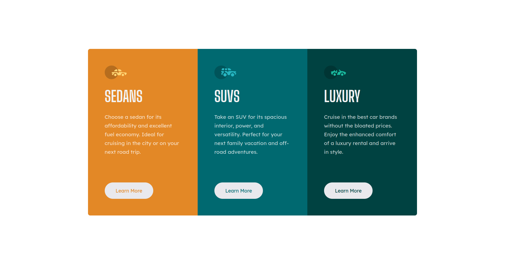
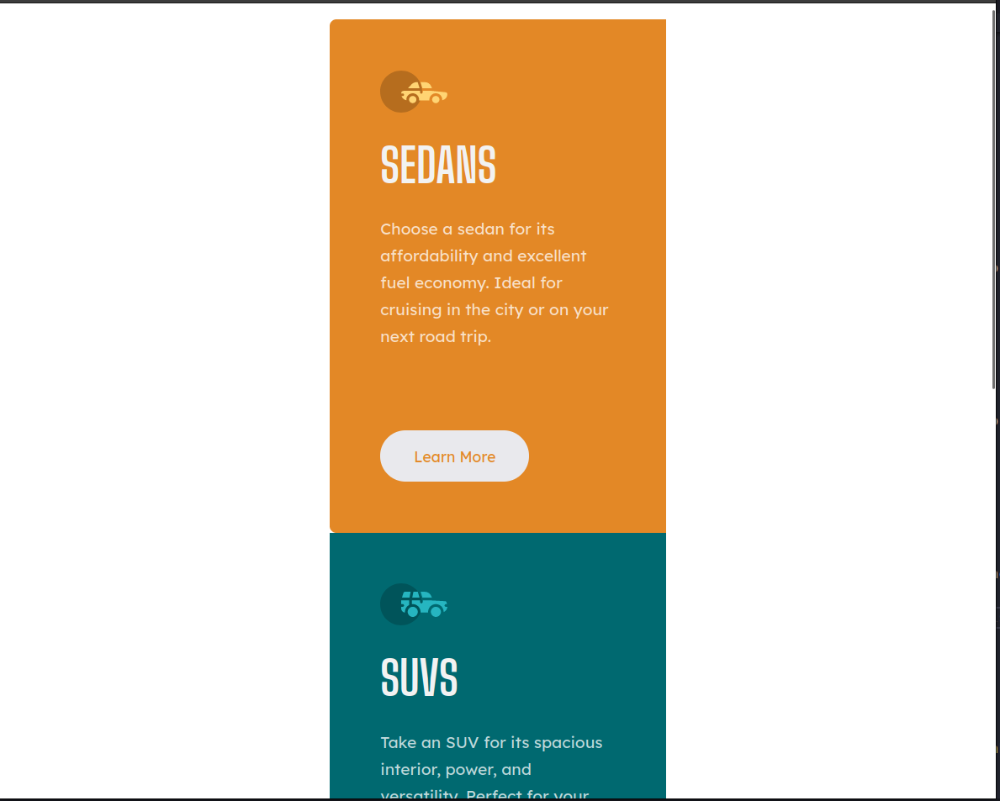
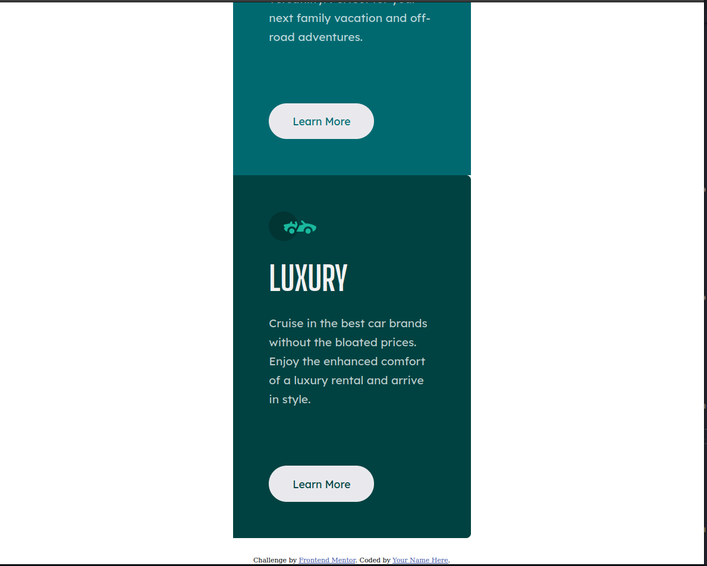

# Frontend Mentor - 3-column preview card component solution

This is a solution to the [3-column preview card component challenge on Frontend Mentor](https://www.frontendmentor.io/challenges/3column-preview-card-component-pH92eAR2-). Frontend Mentor challenges help you improve your coding skills by building realistic projects. 

## Table of contents

- [Frontend Mentor - 3-column preview card component solution](#frontend-mentor---3-column-preview-card-component-solution)
  - [Table of contents](#table-of-contents)
  - [Overview](#overview)
    - [The challenge](#the-challenge)
    - [Screenshot](#screenshot)
    - [Links](#links)
  - [My process](#my-process)
    - [Built with](#built-with)
    - [What I learned](#what-i-learned)
  - [Author](#author)
  - [Acknowledgments](#acknowledgments)

## Overview

### The challenge

Users should be able to:

- View the optimal layout depending on their device's screen size
- See hover states for interactive elements

### Screenshot








### Links

- Solution URL: [https://pedro-cella.github.io/3-column-preview/](https://pedro-cella.github.io/3-column-preview/)
## My process

### Built with

- Semantic HTML5 markup
- CSS custom properties
- Flexbox
- CSS Grid

### What I learned

During the development of this project I could learn two specific knowlegdes that granted me what I needed to finish this project, and none of this would have been possible if my dear friend Henrique Amorim, a full-stack junior developer, haven't teached. This knowledges are:

- Using Flexbox to centralize something. In my case I was changing the margin to centralize things, but I knew it was wrong, that's why I asked my friend to teach me, this way I could learn a new way of how to position things in the screen

- Using CSS Grid to create responsive layout. This was definitly a new thing for me, I didn't even knew about this type of display, Henrique tought me by giving me a challenge, this challenge was to replicate the mobile version, in other word, create a responsive screen. When the screen is compressed, each car's card will be displayed one on top of other

The code that better represent the things I learned are:

```css
.card {
  padding: 3.8rem;
}

.card:nth-child(1) {
  background-color: var(--bright-orange);
  border-radius: 0.5rem 0 0 0.5rem;
}

.card:nth-child(2) {
  background-color: var(--dark-cyan);
}

.card:nth-child(3) {
  background-color: var(--very-dark-cyan);
  border-radius:  0 0.5rem 0.5rem 0 ;
}

@media (max-width: 1200px) {
  .panel {
    margin: 2rem auto;
    grid-template-columns: 1fr;
    max-width: 400px;
  }
}
```
## Author

- Name - Pedro Vítor de Salles Cella
- Frontend Mentor - [@pedro-cella](https://www.frontendmentor.io/profile/pedro-cella)
- Github - [pedro-cella](https://github.com/pedro-cella)


## Acknowledgments

To the person that thought more about the Front End Universe, had the patience to teach me about new css properties and gave me a very fun challenge.

- Github -  [HenriqueAmorim20](https://github.com/HenriqueAmorim20)
